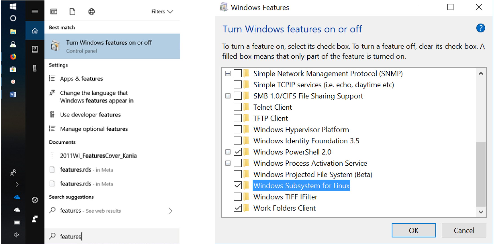
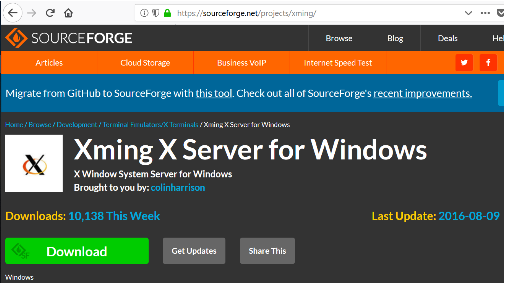

# Installing Ubunutu Linux OS on Windows 10

Inspired by “How to Run Linux/Bash on Windows 10 Using the Built-In…” by Corey Schafer, YouTube

1. Search on “Features” and select “Turn Windows features on or off”. Scroll to bottom of features, select “Windows Subsystem for Linux”, and click ok.



Your computer will probably restart. If you get an error message, restart your computer and repeat this step.

___

2. Goto the Microsoft Store and search on “Linux”. 


___

3. Select the newest version of `Ubuntu`,  20.04. Click “Install” button. When complete select “Launch”


___

4. When prompted, type in your username and a password for `UBUNTU`. Note that when you type in your password, it will appear that nothing is happening, but rest assured that what you type is being recorded.

___

5. Clone the following `github` repo to your computer by by copying and pasting the following code into the command prompt:

```
git clone https://github.com/cbirdlab/wlsUBUNTU_settings.git
```

___

6. Run the `updateSettings.bash` script by copying and pasting the following code into the command prompt:

```
. wlsUBUNTU_settings/updateSettings.bash
```

___

7. Delete the repo by copying and pasting the following code into the command prompt:

```
rm -rf wlsUBUNTU_settings
```

___

8. You should install `xming x server` on windows and run it to run gui apps from `UBUNTU`


